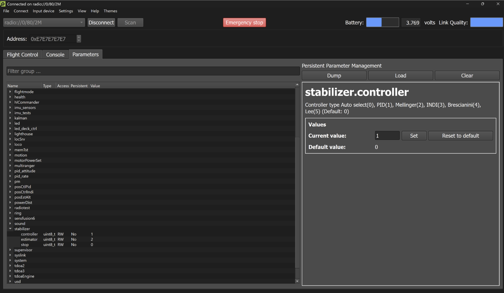

# LQR Controller for Crazyflie

This repository implements a Linear Quadratic Regulator (LQR) controller for the Crazyflie 2.X drone. It is designed to be built as an **App Layer** using the **Out-of-Tree-Controller** capability within the Crazyflie firmware structure.

## Repository Structure

- **`app-lqr/`**: Contains the C source code and Makefile.
  - `src/`: Source files implementing the control logic (check `lqr_controller.c` for gain definitions).
  - `Makefile`: Build configuration.
- **`lqr_params.m`**: MATLAB script used to calculate the optimal gain matrix ($K$) based on the system model and cost weights ($Q$ and $R$).

## Prerequisites

To build, flash, and control this system, you need:

1.  **Crazyflie Firmware**: Clone the official repository:
    ```bash
    git clone [https://github.com/bitcraze/crazyflie-firmware.git](https://github.com/bitcraze/crazyflie-firmware.git)
    ```
2.  **Crazyflie Python Client**: Required for the control GUI and setting parameters.
    - [Installation Instructions](https://github.com/bitcraze/crazyflie-clients-python)
3.  **Toolchain**: Ensure you have the ARM GCC toolchain installed and in your system path.
4.  **MATLAB** (Optional): Required if you wish to re-tune the LQR gains for different hardware configurations.

## Installation & Setup

To use this controller, you must place the application folder inside the firmware's `examples` directory.

1.  **Clone or Download** this repository.
2.  **Move** the `app-lqr` folder from this repository into `crazyflie-firmware/examples/`.
    
    *Your directory structure should look like this:*
    ```text
    crazyflie-firmware/
    ├── src/
    ├── examples/
    │   ├── app-lqr/        <-- Put the folder here
    │   │   ├── src/
    │   │   ├── Makefile
    │   ├── helloworld/
    │   └── ...
    ```
3. Launch the Crazyflie Client Python GUI 'cfclient'


  
4. Click "View" -> "Parameters" -> "stabilizer.control" -> set the controller to 6

## Tuning & Code Generation

> The control gains ($K$) currently implemented in `src/` are tuned specifically for a **stock Crazyflie 2.0**. 
>
> If you are using a **Crazyflie 2.1** (which uses different brushless motors/ESC handling) or if you have attached **Expansion Decks** that alter the drone's total mass, you should update 'lqr_params.m' to prevent instability.

### How to Update Gains
1.  **Configure Parameters**: Open `lqr_params.m` in MATLAB. Update the system parameters (mass `m`, inertia `Ixx`, `Iyy`, `Izz`) to match your specific drone configuration.
2.  **Generate Lookup Table**: Run the script.
    * The script calculates the optimal Linear Quadratic Regulator gains.
    * It outputs a formatted **C-code Lookup Table** (array) in the MATLAB Command Window.
3.  **Update Firmware**:
    * Copy the generated text from the MATLAB output.
    * Open `app-lqr/src/lqr_controller.c`.
    * Replace the existing `K` matrix definition with the new values.
    * Save the file.

## Build & Flash Instructions

Once your gains are set, navigate to the new folder inside the firmware and compile:

```bash
cd crazyflie-firmware/examples/app-lqr
make
cload  # Or use your preferred method to flash (e.g., make cload)
